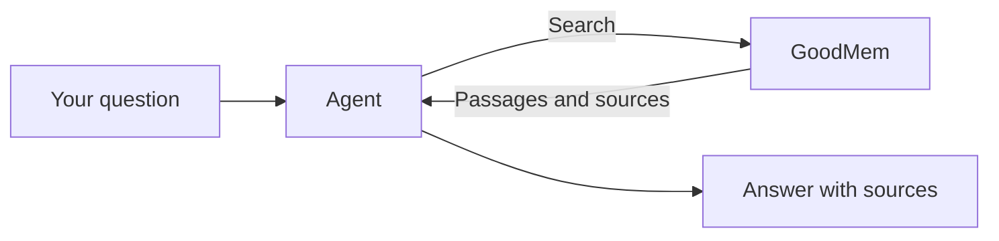

# Agentic RAG with GoodMem

Build a documentation assistant that decides when to search, which sources to consult, and whether it needs another lookup before answering. These four Python notebooks teach agentic retrieval-augmented generation (RAG), from a single LangGraph node to an agent that answers questions across the LangGraph and LangChain documentation, with links to its sources.

Adapted from [Chandula Senevirathna's Agentic_RAG](https://github.com/ChandulaSenevirathna/Agentic_RAG), with [GoodMem](https://goodmem.ai) providing document storage and search.

## What you'll learn

| Notebook | What you'll build and why |
| --- | --- |
| [1 — LangGraph Starter](1_LangGraph_Starter.ipynb) | Start with one function that calls an LLM, then run two functions in parallel. Learn how **state** carries information between steps and how **reducers** combine their updates. |
| [2 — Conditional Routing](2_LangGraph_Conditional_Routing.ipynb) | Classify a question and send it down one of two paths. This introduces **conditional edges**: choosing the next step based on what has happened so far. |
| [3 — Agentic RAG](3_Agentic_RAG.ipynb) | Give an agent two documentation search tools. Follow an explicit graph that retrieves passages, checks their relevance, drafts an answer, and searches again when something is missing. |
| [4 — ReAct Multi-hop RAG](4_ReAct_MultiHop_Agentic_RAG.ipynb) | Solve the same problem with LangChain's prebuilt agent loop. Compare its decisions with the explicit grading and rewriting steps in notebook 3. |

Start at notebook 1 if you're new to LangGraph. If you already know the basics, compare notebooks 3 and 4. Both include a question where the first search reveals what to look up next—that dependent second search is what makes it *multi-hop*.

## What GoodMem changes

The original stores documents in Chroma and computes embeddings locally with BGE-M3. Here, GoodMem stores the documentation, splits it into searchable passages, and handles embeddings, search, and optional reranking. Both agents reuse the stored documents across runs.



## Set up the project

You'll need Git, Python 3.11+, [uv](https://docs.astral.sh/uv/getting-started/installation/), and a [Cohere API key](https://dashboard.cohere.com/api-keys). One key covers the chat, embedding, and reranking API calls in this setup.

For notebooks 3–4 and the retrieval demo, also install and start [Docker Desktop](https://docs.docker.com/get-started/get-docker/), or use Docker Engine with Compose. **Notebooks 1–2 need only the chat configuration; you can start them without Docker or GoodMem.**

In a terminal:

```bash
git clone https://github.com/PAIR-Systems-Inc/Agentic_RAG_GoodMem.git
cd Agentic_RAG_GoodMem
uv sync --locked
cp .env.example .env
```

On Windows, use PowerShell; `Copy-Item .env.example .env` also works for the copy step. `uv sync` creates the project's Python environment and installs its dependencies.

Open `.env` and replace these values:

```dotenv
COHERE_API_KEY=your-cohere-key
CHAT_PROVIDER=cohere
CHAT_MODEL=command-a-03-2025
```

You can now [open notebooks 1–2](#open-the-notebooks). For the retrieval examples, continue below. If you already run GoodMem or prefer Groq for chat, see [other configurations](docs/running-the-demo.md).

## Ask your first question

From the project folder, start GoodMem and load the six documentation pages:

```bash
docker compose up -d --wait
uv run goodmem-rag setup --init --with-reranker
```

Use `--init` for the first setup of a new server. When setup prints `Ready: 6 documents in 2 spaces.`, ask a question:

```bash
uv run goodmem-rag ask "What is a checkpointer used for in LangGraph? Cite the docs."
```

An excerpt from a [recorded answer](docs/validation/shared-integration/release-0.2.0/evaluation.json):

> When a graph is compiled with a checkpointer, LangGraph can save the state of the graph at various points, allowing for resumption of execution if it is interrupted or needs to be retried.
>
> Source: [LangGraph Graph API overview](https://docs.langchain.com/oss/python/langgraph/graph-api)

The command also prints the searches the agent made, so you can follow how it reached its answer. Try a question that needs both collections:

```bash
uv run goodmem-rag ask "Compare LangGraph StateGraph with the LangChain agent loop. Cite both docs."
```

The default is the ReAct agent from notebook 4. Add `--agent graph` to try notebook 3's explicit graph with the same question.

Reranking is optional: omit `--with-reranker` during initial setup to start with plain search. Reranking itself requires no LLM. Stop the local server with `docker compose stop`; your indexed documents persist. See the [running guide](docs/running-the-demo.md) for restarting or refreshing them.

## Open the notebooks

For **JupyterLab**, register the project environment as a kernel and launch the browser interface:

```bash
uv run python -m ipykernel install --sys-prefix --name goodmem-rag --display-name "GoodMem RAG"
uv run --group notebooks jupyter lab
```

Open a notebook from the file browser and select the **GoodMem RAG** kernel.

For **VS Code**, install the [Python](https://marketplace.visualstudio.com/items?itemName=ms-python.python) and [Jupyter](https://marketplace.visualstudio.com/items?itemName=ms-toolsai.jupyter) extensions, then open this repository's folder. Open a notebook, click **Select Kernel**, and choose the Python environment in this project's `.venv`.

Run cells from top to bottom, or use **Run All**. Each notebook has its own kernel selection; if one works and another reports missing imports, check that both use the project environment.

## Explore further

- [Running the demo](docs/running-the-demo.md): existing servers, Groq, troubleshooting, and validation commands.
- [GoodMem findings](docs/goodmem-rough-edges.md): what worked, what was awkward, and what this experiment establishes.
- [LangChain integration](docs/langchain-integration-review.md): the shared library and the code it replaces.

The [recorded live validation](docs/validation/shared-integration/release-0.2.0/) passed all four notebooks, 16 retrieval checks, and eight agent cases. Answers can vary; this is not a comparison of answer quality against the original.

Original work by Chandula Senevirathna. See the preserved [license notice](LICENSE.md) and [upstream provenance](docs/upstream.md).
