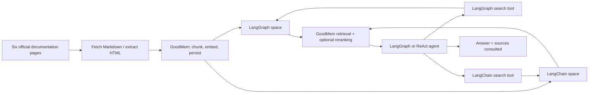

# Agentic RAG with GoodMem

A working GoodMem adaptation of [Chandula Senevirathna's Agentic_RAG](https://github.com/ChandulaSenevirathna/Agentic_RAG). It keeps the four-notebook progression and both agent patterns, and moves document chunking, embedding, persistence, retrieval, and optional reranking into GoodMem.

The original commit history and [license notice](LICENSE.md) are preserved. See [upstream provenance](docs/upstream.md). This repository is a private evaluation adaptation because upstream's mixed license still names older notebook files.



GoodMem reranking **does not require an LLM**. The chat model runs in the agent application. This demo does not register an LLM or request summarization inside GoodMem.

## Quickstart

You need Python 3.11+, [uv](https://docs.astral.sh/uv/), Docker Compose, and a Cohere API key. The tested one-provider configuration uses Cohere for embeddings, optional reranking, and agent chat. Groq, the original project's chat provider, is also supported.

```bash
git clone https://github.com/PAIR-Systems-Inc/Agentic_RAG_GoodMem.git
cd Agentic_RAG_GoodMem
uv sync --locked
cp .env.example .env
```

For the one-provider setup, edit `.env`:

```dotenv
GOODMEM_BASE_URL=http://localhost:8088
COHERE_API_KEY=your-cohere-key
CHAT_PROVIDER=cohere
CHAT_MODEL=command-a-03-2025
```

Then run:

```bash
docker compose up -d --wait
uv run goodmem-rag setup --init --with-reranker
uv run goodmem-rag search langgraph 'How does the add_messages reducer work?'
uv run goodmem-rag ask 'Compare LangGraph StateGraph with the LangChain agent loop. Cite both docs.'
uv run goodmem-rag ask 'What is a checkpointer used for in LangGraph?' --agent graph
```

Omit `--with-reranker` to use plain vector retrieval. `search --no-rerank` bypasses a configured reranker. For Groq chat, set `CHAT_PROVIDER=groq`, `CHAT_MODEL=openai/gpt-oss-120b`, and `GROQ_API_KEY`; keep the embedding configuration separately.

The local server binds to loopback port 8088. Change `GOODMEM_PORT` and `GOODMEM_BASE_URL` together if that port is busy. The Compose file pins the validated GoodMem image and persists PostgreSQL data in a named volume. `docker compose stop` stops the demo while preserving it.

`--init` bootstraps a new server and saves its key privately in ignored `.runtime/credentials.json`; subsequent commands reuse it. Initialization does not recover a key for an already initialized server. Keep `.runtime` and the database volume together when restarting the local demo.

## Use an existing GoodMem server

Set `GOODMEM_BASE_URL` to its REST server root and `GOODMEM_API_KEY` to a credential allowed to configure and ingest into your demo spaces. Use the REST port, without `/v1` or `/mcp`; the CLI's gRPC URL is a different interface.

Set `GOODMEM_EMBEDDER_ID` to an existing embedder ID. Otherwise, setup registers `GOODMEM_EMBEDDING_MODEL` (default `embed-v4.0`) using `EMBEDDING_API_KEY` or `COHERE_API_KEY`. A known model identifier lets the SDK infer provider configuration. You can likewise set `GOODMEM_RERANKER_ID` to an existing reranker.

```bash
uv run goodmem-rag setup
```

Do not pass `--init` for an existing installation. Each run fetches the six source pages, waits for indexing to reach `COMPLETED`, reuses unchanged memories, and replaces outdated versions only after the new ones index. Other memories and spaces are not removed. An existing reranker selection persists across notebook reruns.

`GOODMEM_NAMESPACE` selects the corpus namespace. To create another namespace on the same instance, reuse your existing `GOODMEM_EMBEDDER_ID`; GoodMem rejects equivalent embedder registrations under different IDs. `.runtime/state.json` contains the resulting resource IDs and source hashes. `GOODMEM_RUNTIME_DIR` allows separate local state directories.

This is a local teaching demo. It uses the configured GoodMem credential for setup and retrieval; for an application with untrusted users, provision a separate restricted retrieval credential and separate the setup process.

## Notebooks

| Notebook | What it demonstrates |
| --- | --- |
| [1 — Starter](1_LangGraph_Starter.ipynb) | State, reducers, an LLM node, and parallel graph nodes |
| [2 — Conditional routing](2_LangGraph_Conditional_Routing.ipynb) | LLM classification and conditional edges |
| [3 — Agentic RAG](3_Agentic_RAG.ipynb) | Explicit agent → retrieve → grade → draft/rewrite loop |
| [4 — ReAct multi-hop RAG](4_ReAct_MultiHop_Agentic_RAG.ipynb) | Prebuilt `create_agent`, tool limits, and dependent searches |

```bash
uv run --group notebooks jupyter lab
```

Choose the project's `.venv` Python interpreter. All notebooks have clean outputs in Git. The first two need only chat credentials; the RAG notebooks also need the configured GoodMem instance. Graph diagrams are Mermaid text, so execution does not depend on a remote rendering API.

The notebooks share the tested code in [goodmem_rag](goodmem_rag/). The explicit graph grades all results from the latest retrieval round, retains accumulated evidence, and completes pending tool calls before stopping at its hop limit. The ReAct agent enforces tool and model call limits. Each answer includes a deterministic **Sources consulted** list from the retrieved metadata; inline claim citations remain model generated.

## Validation and findings

```bash
uv run pytest -q
uv run ruff check goodmem_rag tests scripts
uv run goodmem-rag evaluate
uv run python scripts/probe_goodmem.py
uv run python scripts/run_notebooks.py
```

The live evaluation checks eight retrieval questions with and without reranking, plus direct-answer, single-space, cross-space, and sequential retrieval cases for both agents. Plain retrieval returns five candidates; reranking selects five from twenty. It records source hashes, model/server versions, latency, tool calls, raw model answers, and displayed answers in `.runtime/evaluation.json`. Source coverage and keyword checks are acceptance checks, not a full answer-quality benchmark.

Notebook execution uses a fresh kernel per notebook and saves results under `.runtime/executed/`. CI runs offline unit tests and validates notebook syntax and clean outputs; it does not spend provider credits or connect to GoodMem.

See [the GoodMem rough-edge report](docs/goodmem-rough-edges.md) and [checked-in validation artifacts](docs/validation/). This demonstrates a working migration. It does **not** establish better quality or performance than upstream Chroma + BGE-M3: the embedding model and source extraction changed, and no controlled baseline was run.
